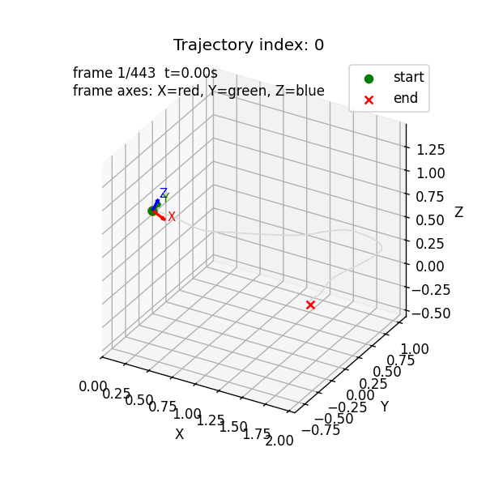
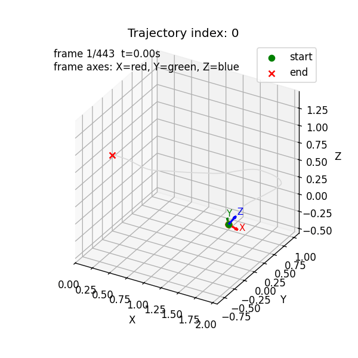
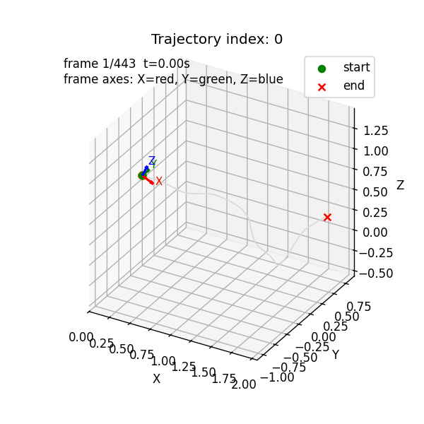
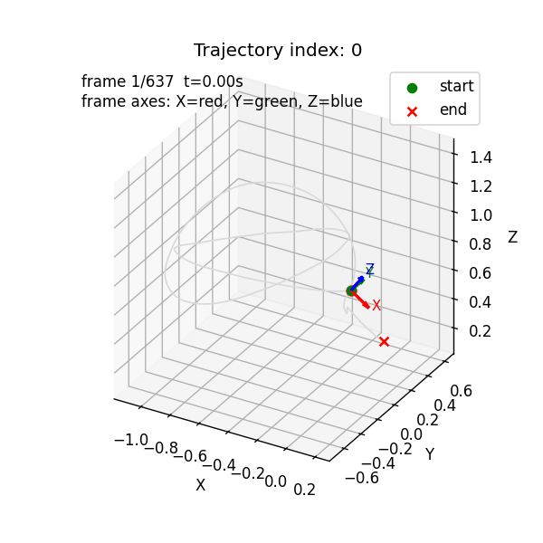

## Use Guide

> ### 0.Download CamTrackAR (Only on IOS System)
> 

> ### 1.Extract .motn Files
> When record trajectory on CamTrackAR APP, you will have lots of files with .mp4 .py and other stuff.  
However, we only need the .motn files.  
So you can run [motn_filter.ipynb](motn_filter.ipynb) to extract only the motn files to you target folder.

> ### 2.AR convert to .pkl trajectory
> [trajs_ar.ipynb](trajs_ar.ipynb) helps convert .motn files to .pkl trajectory files  
> The trajectory agmenting is also done here, such as mirror and backplay agmenting.

> ### 3.Trajectory Frequency Resample
> [trajs_resample.ipynb](trajs_resample.ipynb) helps resample trajectory to desired frequency

> ### 4.Trajectory File Merge
> [trajs_merge.ipynb](trajs_merge.ipynb) can merge different .pkl trajectory files  
For example you can merge UMI trajectories with your collected trajectories

## Additionl Functions

> ### Trajectory Visualization
> [trajs_vis.ipynb](trajs_vis.ipynb) can visualize trajectory

> ### Trajectory Add Noise Visualization
> [trajs_vis_noise.ipynb](trajs_vis_noise.ipynb) can visualize trajectory with noise

## Some Pictures

  

